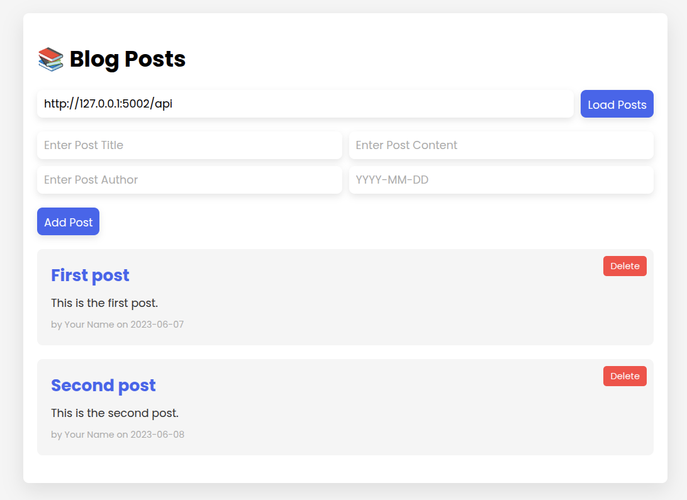
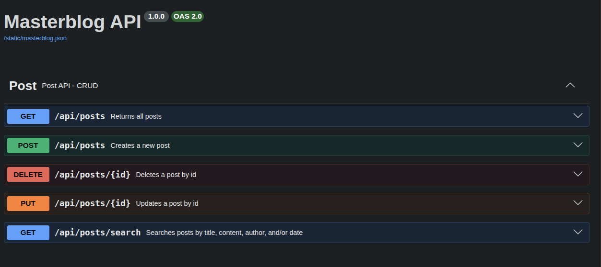

# masterblog-api

A small full-stack blog application: a Flask REST API backend and a vanilla JS/HTML/CSS frontend that consumes it.

## Features

- CRUD for blog posts (`title`, `content`, `author`, `date`)
- Pagination-free listing with **sorting** (`sort`, `direction`) and **search** (by any field) via query parameters
- Persistent storage in a local JSON file (`backend/posts.json`), survives server restarts
- Clean JSON error responses for missing fields, not-found posts, corrupted storage, and unknown routes
- Interactive API docs via Swagger UI (`flask-swagger-ui`)
- CORS enabled, so the frontend can talk to the backend across ports

## Screenshots

**Frontend**: list, create, and delete posts, with author/date shown per post:



**Backend**: interactive Swagger UI documenting all endpoints:



## Project Structure

```text
masterblog-api/
├── backend/
│   ├── backend_app.py      # Flask API (routes, error handlers)
│   ├── utils.py             # Post model, load/save helpers, id/lookup helpers
│   ├── posts.json           # persisted blog post data
│   └── static/
│       └── masterblog.json  # Swagger/OpenAPI spec
├── frontend/
│   ├── frontend_app.py      # Flask app serving the frontend page
│   ├── templates/
│   │   └── index.html
│   └── static/
│       ├── main.js
│       └── styles.css
├── pyproject.toml
└── uv.lock
```

## Requirements

- Python >= 3.14
- [uv](https://docs.astral.sh/uv/) for dependency management

## Setup

```bash
uv sync
```

This installs `flask`, `flask-cors`, and `flask-swagger-ui` into a local `.venv`.

## Running

Start the backend (port `5002`):

```bash
uv run python3 backend/backend_app.py
```

Start the frontend (port `5001`), in a separate terminal:

```bash
uv run python3 frontend/frontend_app.py
```

Then open [http://127.0.0.1:5001](http://127.0.0.1:5001) in your browser. The frontend's "API Base URL" field defaults to `http://127.0.0.1:5002/api`.

## API

Base URL: `http://127.0.0.1:5002/api`

| Method   | Endpoint        | Description                                                                                                                    |
| -------- | --------------- | ------------------------------------------------------------------------------------------------------------------------------ |
| `GET`    | `/posts`        | List all posts. Supports `?sort=title\|content\|author\|date` and `?direction=asc\|desc`                                       |
| `POST`   | `/posts`        | Create a post. Body: `{"title", "content", "author", "date"}`                                                                  |
| `PUT`    | `/posts/<id>`   | Update a post. All fields optional; omitted fields are kept                                                                    |
| `DELETE` | `/posts/<id>`   | Delete a post                                                                                                                  |
| `GET`    | `/posts/search` | Search posts. Supports `?title=`, `?content=`, `?author=`, `?date=` (matches if any is a substring of the corresponding field) |

Interactive docs (Swagger UI): [http://127.0.0.1:5002/api/docs](http://127.0.0.1:5002/api/docs)

## Data Persistence

Posts are stored in `backend/posts.json`. If the file is missing, the API starts with an empty list. If the file contains invalid JSON, the API returns a `500` with a clear error message instead of crashing.